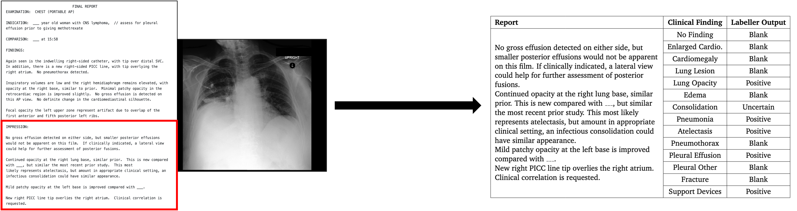
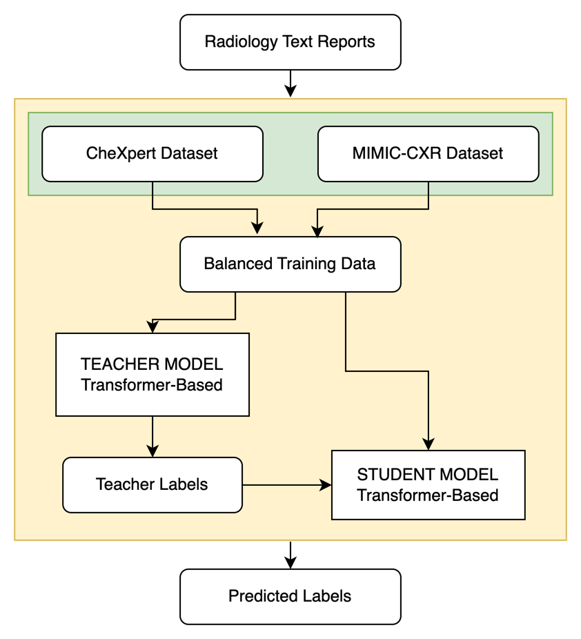
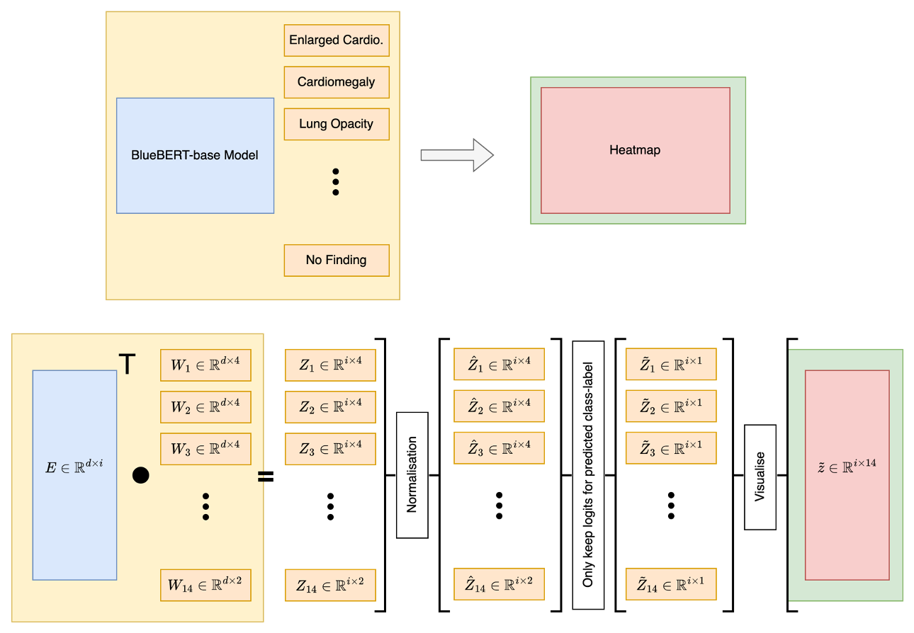

# MSc Individual Project

## 1. Automatic classification of radiology text reports using rule-based and transformer-based models.

The task at hand is to label the impressions sections of radiology text reports for 14 different classes. The task is shown in the image below, with the text report on the left and the labelled report on the right.



### 1.1. Data
#### 1.1.1. Input Data for Rule-Based Labeller
Sample input data for the rule-based labeller is available in `data/rule/sample_input.csv`. The data is in the form of a CSV file with 2 columns:
 - `Report_ID` - The unique identifier for each report.
 - `Report` - The text of the radiology report.

#### 1.1.2. Input Data for Transformer-Based Labeller
Sample input data for the transformer-based labeller is available in `data/transformer/sample_input.csv`. The data is in the form of a CSV file with 1 column:
 - `Report` - The text of the radiology report.

### 1.2. Using the CheXpert (Rule-Based) Labeller
#### 1.2.1. Installation
Install and create the conda environment
``` 
conda env create -f rule.yml
```

Activate the conda environment
``` 
conda activate rule
```

#### 1.2.2. Running the labeller
Replace the `REPORT_PATH` in the `scripts/run_chexpert.sh` file with the path to the input data file. <br> Then run the following command:
``` 
./scripts/run_chexpert.sh
```


### 1.3. Using the CheXbert (Transformer-Based) Labeller
#### 1.3.1. Installation
Install and create the conda environment
```
conda env create -f transformer.yml
```

Activate the conda environment
```
conda activate transformer
```

#### 1.3.2. Running the labeller
Replace the `INPUT_PATH` in the `scripts/run_chexbert.sh` file with the path to the input data file, and the `MODEL_PATH` with the path to the CheXbert model. <br> Then run the following command:
```
./scripts/run_chexbert.sh
```

### 1.4. Using the project model (Transformer-Based)
The project model training worflow is shown in the image below.


#### 1.4.1. Installation
Install and create the conda environment
```
conda env create -f transformer.yml
```

Activate the conda environment
```
conda activate transformer
```

#### 1.4.2. Running the labeller
Replace the `INPUT_PATH` in the `scripts/run_labeller.sh` file with the path to the input data file, and the `MODEL_PATH` with the path to the project model. <br> Then run the following command:
```
./scripts/run_labeller.sh
```

<!--#### 1.5. Training a new model-->

### 1.6. Evaluation
1. Open the following jupyter notebooks: <br>
 ```notebooks/evaluation_experiments_report.ipynb```

2. Replace the filenames with the path to the output file to be evaluated.
3. Run the jupyter notebook.


## 2. Token attention visualisation tool for BERT-based classification models.

### 2.1. Environment setup
1. Install and create the conda environment <br>
``` conda env create -f visual.yml```

2. Activate the conda environment <br>
``` conda activate visual```

### 2.2. Usage
1. Open the following jupyter notebooks: <br>
 ```notebooks/token_impact_visualisation.ipynb``` 
and 
```notebooks/demo(2of2).ipynb ```
2. Replace the `model_path` with the path to the model to be visualised.
3. Run the jupyter notebook.

They visualise the token attention of the BERT based model with 14 linear heads in the form of a heatmap.




<!--TODO - Mention inspired by and then hyperlink to paper and/or code.
TODO - Add a readme in the data_msc_project folder.
TODO - Add repo structure, or just for the data
TODO - File addresses in the notebooks
TODO - Cleaning the notebooks
TODO - Add instructions for training a new model-->

## 3. References
- CheXpert (Rule-Based Labeller):
```
@article{irvin2019chexpert,
  title={CheXpert: A Large Chest Radiograph Dataset with Uncertainty Labels and Expert Comparison},
  author={Irvin, Jeremy and Rajpurkar, Pranav and Ko, Michael and Yu, Yifan and Ciurea-Ilcus, Silviana and Chute, Chris and Marklund, Henrik and Haghgoo, Behzad and Ball, Robyn and Shpanskaya, Katie and others},
  journal={Proceedings of the AAAI Conference on Artificial Intelligence},
  volume={33},
  pages={590--597},
  year={2019}
}
```

- CheXbert(Transformer-Based Labeller):
```
@article{wang2020chexbert,
  title={CheXbert: Combining Automatic Labelers and Expert Annotations for Accurate Radiology Report Labeling Using BERT},
  author={Wang, Xinyu and Peng, Yifan and Lu, Le and Lu, Zhiyong},
  journal={arXiv preprint arXiv:2004.09162},
  year={2020}
}
```

- MIMIC-CXR:
```
@article{johnson2019mimic,
  title={MIMIC-CXR: A large publicly available database of labeled chest radiographs},
  author={Johnson, Alistair EW and Pollard, Tom J and Berkowitz, Shihao and Greenbaum, Noah R and Lungren, Matthew P and Deng, Cindy Y and Mark, Roger G and Horng, Steven},
  journal={arXiv preprint arXiv:1901.07042},
  year={2019}
}
```
